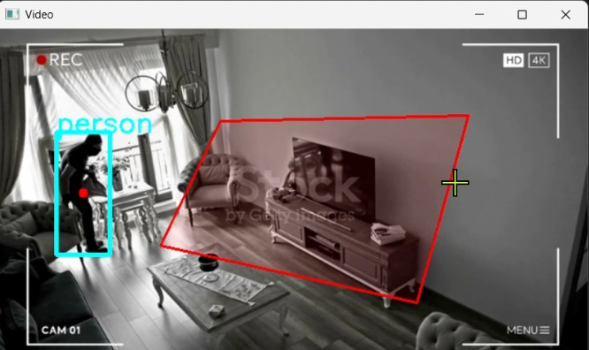
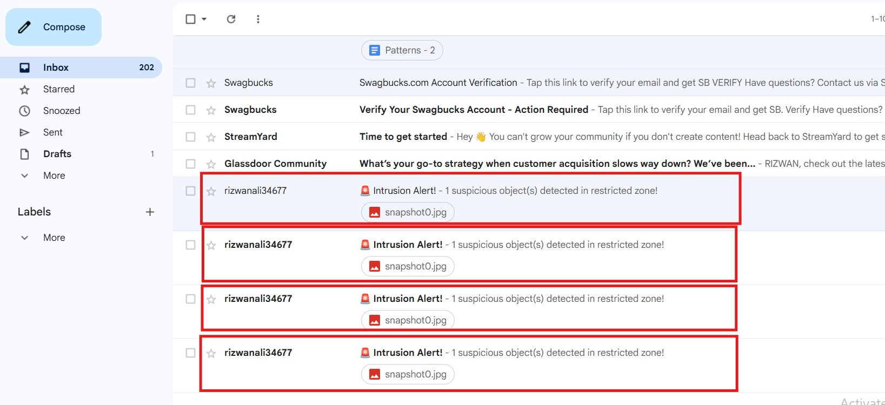

# Security Alarm System

A real-time security alarm system leveraging YOLOv8 for object detection. The system detects unauthorized individuals or suspicious objects and immediately sends alerts via email and webhooks.

## Features

- **Real-Time Object Detection** using YOLOv8
- **Instant Email & Webhook Notifications**
- **Captured Intrusion Images**
- **Flexible & Configurable for Any Environment**

---
## 🎥 Demo Video

[](https://www.youtube.com/embed/F4n8Uv5w4Ow?autoplay=1)

---

## 🖼️ Screenshots

<table>
  <tr>
    <td></td>
    <td></td>
  </tr>
</table>

## Project Structure

```bash
Security-_Alarm_System/
├── Alarm/                 #  alarm sounds
├── Detected Photos/      # Saved detection snapshots
├── test_videos/          # Sample input videos
├── alarm.py              # Main alarm script
├── utils.py              # Utility functions
├── yolo11n.pt            # YOLOv8 model weights
├── .env                  # Env variables (add your credentials here)
├── requirements.txt
├── LICENSE
└── README.md
```


### Prerequisites

Ensure you have the following installed:

- Python 3.8+
- `pip`
- (Optional) Virtual environment tool

### Installation

### Clone the Repository

```bash
git clone https://github.com/Rizwanali324/Security-_Alarm_System.git
cd Security-_Alarm_System
```


### Create a Virtual Environment (optional) install labs

```bash
python -m venv venv
source venv/bin/activate  # On Windows: venv\Scripts\activate
pip install -r requirements.txt

```


### Configure Environment Variables

```bash
# Email credentials
EMAIL_SENDER = "your@gmail.com"  # Sender email address
EMAIL_PASSWORD = "your passwar szra toye opra"  # App password generated via: https://myaccount.google.com/apppasswords
EMAIL_RECEIVER = "reciver mail@gmail.com"  # Receiver email address

```
### Run the Main Script

```bash
python alarm.py
```

### 🤝 Contributing
Contributions are welcome! Feel free to fork this repository and open a pull request.